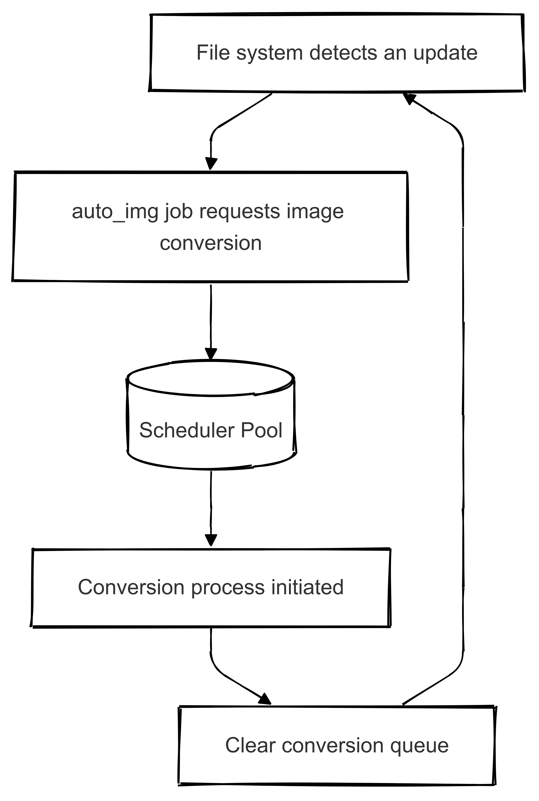

<h1 align="center">
   auto_img
</h1>

<h4 align="center">
  Effortlessly convert image formats in the background.
</h4>

  <strong>auto_img</strong> is a lightweight desktop application that simplifies image format conversion, running seamlessly in the background. Currently available for Windows, with support for more platforms coming soon!

  

## Supported Formats  

### Input  
- `webp`  
- `png`  
- `jpg`  
- `tiff`  
- `gif`  
- `bmp`  
- `ico`  

### Output  
- `png`  
- `jpg`  
- `tiff`  
- `gif`  
- `bmp`  

## How it works

auto_img at its core is just an app that scans for file changes and detects if a target file is found and converts it. With this simple control flow:

### Terminology

#### Jobs

There are two kinds of jobs, but the main definition is just a task that needs to be executed.

1. **Agent Defined Job**
These are jobs that are 

#### Scheduling

This refers to a jo

### Agent adds a job

This process refers to the user (you) clicking the button to add a specific job.

###
